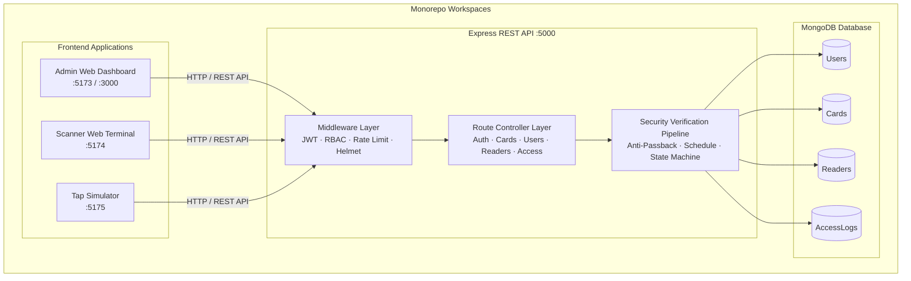
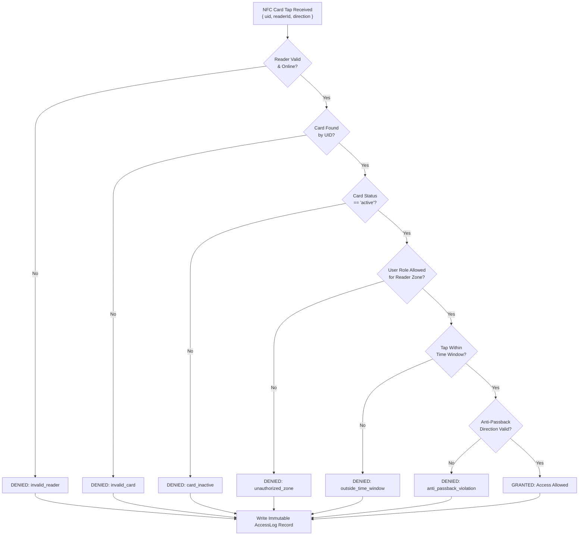
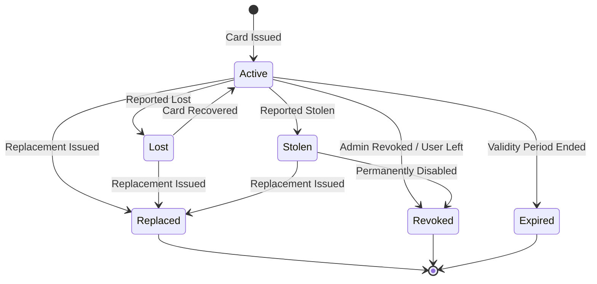

# An NFC-Based Secure Access Control System

> **Enterprise-Grade Real-Time NFC Access Control, Hardware Simulation & Administrative Suite**  
> *Monorepo powered by Node.js, Express, MongoDB, React 19, Tailwind CSS v4, and DaisyUI 5.*

---

##  Project Overview

The **NFC-Based Secure Access Control System** is a unified, enterprise-grade security solution designed for universities, corporate campuses, and restricted facilities. It provides end-to-end management of physical access control—from physical NFC card taps at reader stations to card lifecycle management, role-based authorization, time-window constraints, anti-passback anti-tailgating enforcement, and real-time security audit logging.

The system is structured as a **modern monorepo** comprising:
1. **Admin Web Dashboard (`frontend/admin-web`)**: High-density management interface for security personnel to manage cardholders, monitor live taps, revoke cards, issue temporary access, and inspect audit logs.
2. **Scanner Web Application (`frontend/scanner-web`)**: Emulated physical hardware reader terminal interface deployed at access points.
3. **Simulation Web Application (`frontend/simulation-web`)**: Interactive tap simulator for testing physical NFC card taps under varying access scenarios.
4. **Core Express API Backend (`backend`)**: High-performance RESTful API implementing the security evaluation engine, anti-passback algorithm, card lifecycle state machine, and MongoDB persistence.

---

##  Technical & Architectural  Decisions🌟

What makes this access control system stand out from generic CRUD applications:

### 1.  Multi-Stage Zero-Trust Verification Pipeline
Every NFC tap received at `/api/access/tap` passes through a **non-bypassable 8-stage verification pipeline** before granting entry:
```
[NFC Tap Request] 
  └─► 1. Reader Registration & Active Status Check
  └─► 2. Card UID Existence Lookup
  └─► 3. Card Status Verification (Must be 'Active')
  └─► 4. Cardholder Account Status (Must be active & not suspended)
  └─► 5. Role-Based Access Control (RBAC Check against Reader.allowedRoles)
  └─► 6. Time-Window & Schedule Validation (Reader.accessSchedule)
  └─► 7. State-Aware Anti-Passback Evaluation (Direction entry/exit sequence)
  └─► 8. Immutable AccessLog Audit Record Commit
```
If any stage fails, the system immediately rejects access with an explicit denial code (`invalid_reader`, `invalid_card`, `card_inactive`, `unauthorized_zone`, `outside_time_window`, `anti_passback_violation`) and records the incident in the audit database.

### 2.  Anti-Passback Enforcement Engine
To prevent tailgating, card sharing, and unauthorized entry duplication, the backend evaluates the user's **historical directional state**:
- If a cardholder's last recorded valid tap at a zone was an `entry`, their next tap at that zone **must** be an `exit`.
- Attempting an `entry` twice in succession without a matching `exit` triggers an immediate **`anti_passback_violation`**, flagging a potential security breach.

### 3.  State-Machine Driven Card Lifecycle Management
Cards are modeled with a formal state machine (`Active` ➔ `Lost` | `Stolen` | `Revoked` | `Replaced` | `Expired`):
- **Linked Replacement Chain**: When issuing a replacement card, the old card transitions to `replaced` and receives a `replacedBy` reference to the new card, maintaining a complete, auditable lineage of card re-issuances over a cardholder's tenure.
- **Instant Revocation Propagation**: Deactivating a user or flagging a card as lost/stolen instantly invalidates physical reader taps across all campus doors without requiring a reader reboot.

### 4.  Unified Monorepo Architecture
By maintaining `admin-web`, `scanner-web`, `simulation-web`, and `backend` within an npm workspaces monorepo:
- Developers can launch the entire ecosystem concurrently with a single command (`npm run dev`).
- Frontend applications share backend interface definitions, API client helpers, and styling design tokens.

### 5. 🎨 High-Density Enterprise Admin Experience
- **Admin Dashboard**: Features quick period selectors (`24H`, `7D`, `30D`), real-time metric cards with trend indicators, searchable activity feed with type filters (`All`, `Taps`, `Admin`), and administrative quick action shortcuts.
- **Interactive Audit Inspector**: High-contrast, sticky-header table supporting multi-field instant search (UID, user, reader, door), result/role filter dropdowns, client-side pagination, Excel export (`xlsx`), and an inline **Log Inspection Modal** for deep transaction analysis.

---

## 🏗️ System Architecture



---

## 📊 Core Decision Flows & Diagrams

### 1. NFC Tap Verification Flow



### 2. Card Lifecycle State Machine



---

## 📁 Repository Structure

```
nfc-access-control/
├── frontend/
│   ├── admin-web/                  # React 19 + Vite + Tailwind CSS v4 + DaisyUI 5
│   │   ├── src/
│   │   │   ├── Api/                # Axios API service client layer
│   │   │   ├── component/          # Layout & Shared UI (DashboardLayout, Notification)
│   │   │   ├── pages/
│   │   │   │   ├── Auth/           # Login, Register, Password Reset
│   │   │   │   └── dashboard/admin/# Admin Dashboard, Audit Logs, Users, Cards, Roles
│   │   │   └── App.jsx             # React Router setup
│   │   └── package.json
│   ├── scanner-web/                # Physical Reader Terminal Interface
│   └── simulation-web/             # NFC Tap Simulator Page
│
├── backend/                        # Node.js + Express REST API (MVC Pattern)
│   ├── src/
│   │   ├── config/                 # DB connection & Constants
│   │   ├── controllers/            # Auth, User, Card, Reader & Access Controllers
│   │   ├── middlewares/            # JWT Auth, RBAC Authorization, Rate Limiter, Error Handler
│   │   ├── models/                 # Mongoose Schemas (User, Card, Reader, AccessLog)
│   │   ├── routes/                 # Express API Route Definition
│   │   ├── services/               # Access Verification & Card State Machine Business Logic
│   │   └── server.js               # Express Server Entry Point
│   └── package.json
│
├── ARCHITECTURE.md                 # System Architecture Blueprint
├── package.json                    # Monorepo root scripts & workspaces definition
└── README.md                       # Project Documentation
```

---

## 🔌 API Reference Highlights

| Method | Endpoint | Auth | Role | Description |
| :--- | :--- | :--- | :--- | :--- |
| `POST` | `/api/auth/login` | None | Public | Authenticate user & return JWT token |
| `POST` | `/api/auth/register` | None | Public | Register new user account |
| `GET` | `/get/profile` | JWT | Any | Get current user profile |
| `POST` | `/api/access/tap` | Reader Payload | System | **Core NFC Tap Verification Endpoint** |
| `GET` | `/access/logs` | JWT | Admin/Security | Fetch security audit logs |
| `GET` | `/dashboard/stats` | JWT | Admin | Fetch aggregate security statistics |
| `GET` | `/dashboard/recent-activity` | JWT | Admin | Fetch live recent tap and admin events |
| `GET` | `/api/cards` | JWT | Admin | List all NFC card records |
| `POST` | `/api/cards` | JWT | Admin | Register & issue new NFC card |
| `PUT` | `/api/cards/:id/lost` | JWT | Admin | Mark card as lost |
| `PUT` | `/api/cards/:id/stolen` | JWT | Admin | Mark card as stolen & revoke |
| `PUT` | `/api/cards/:id/replace` | JWT | Admin | Issue replacement card & link reference |
| `GET` | `/api/Admin/get/all-staff` | JWT | Admin | List all staff members |

---

##  Quick Start Guide

### Prerequisites
- **Node.js**: `v18.x` or `v20.x` higher
- **npm**: `v9.x` or higher
- **MongoDB**: Local MongoDB instance running on `mongodb://localhost:27017` or MongoDB Atlas URI

### 1. Clone & Install Dependencies

```bash
git clone https://github.com/Yamuhammad01/NFC-Based-Secure-Access-Control-System.git
cd NFC-Based-Secure-Access-Control-System

# Install dependencies across all monorepo workspaces
npm install
```

### 2. Environment Configuration

Create a `.env` file inside the `backend/` directory:

```env
PORT=5000
MONGO_URI=mongodb://localhost:27017/nfc_access_control
JWT_SECRET=your_super_secret_jwt_key_here
NODE_ENV=development
```

### 3. Run Monorepo in Development Mode

Run all micro-frontends and backend concurrently using the monorepo root command:

```bash
npm run dev
```

This launches:
-  **Backend REST API**: `http://localhost:5000`
-  **Admin Web Dashboard**: `http://localhost:5173` (or Vite assigned port)
-  **Scanner Terminal**: `http://localhost:5174`
-  **NFC Tap Simulator**: `http://localhost:5175`

---

##  Verification & Build Scripts

```bash
# Build all workspaces for production
npm run build

# Run build specifically for admin frontend
npm --prefix frontend/admin-web run build

# Lint codebases
npm run lint
```

---

##  License

This project is licensed under the MIT License.
